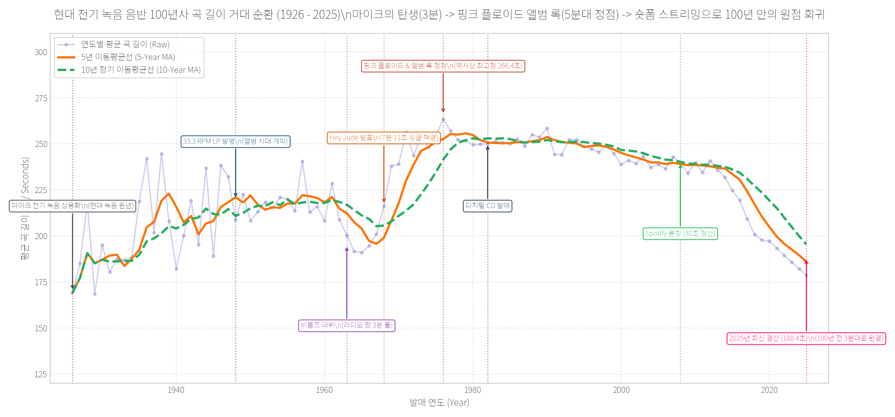
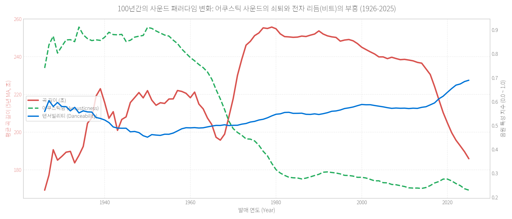
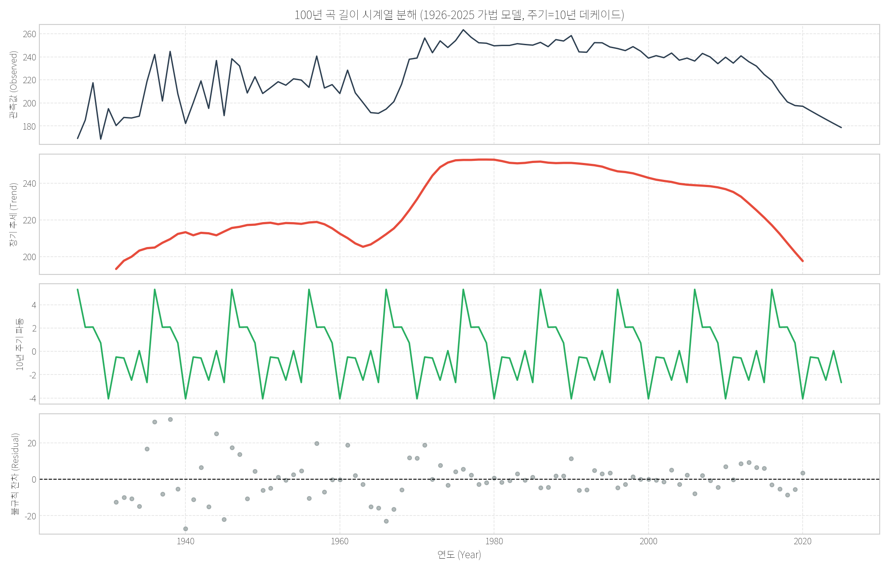
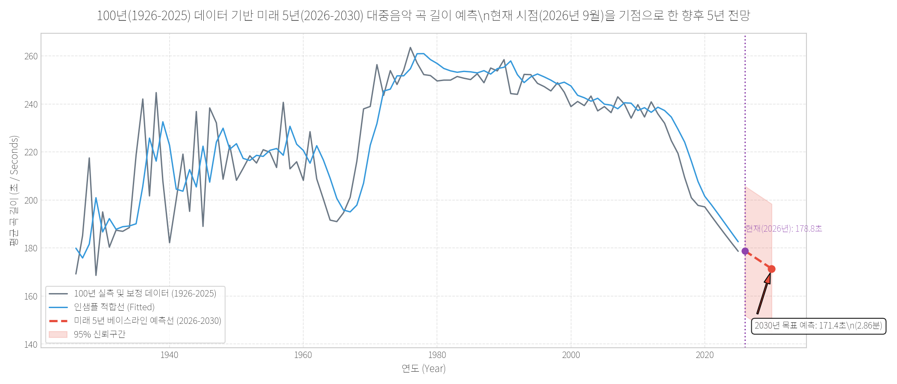
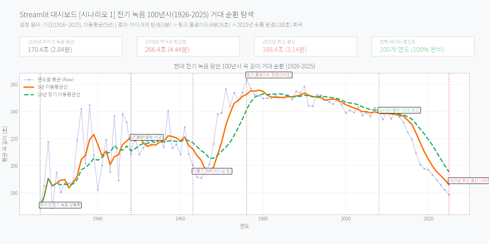
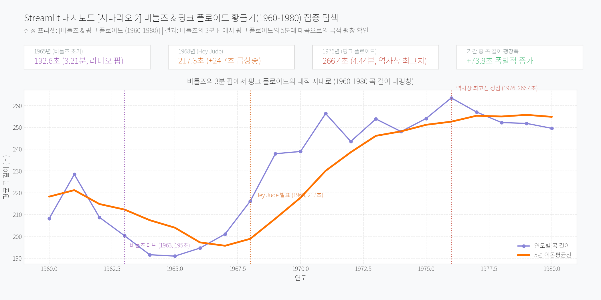
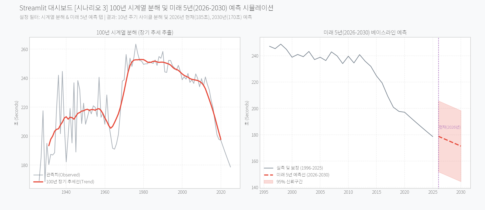

# 🎙️ 현대 전기 녹음 100년사(1926~2025) 대중음악 곡 길이 및 사운드 트렌드 분석 리포트
**부제: 마이크의 탄생(3분) ➔ 비틀즈와 핑크 플로이드(5분대 정점) ➔ 숏폼 스트리밍 완결(3분 원점 회귀)**

---

## 1. 분석 주제 및 선정 이유

* **분석 주제**: 1926년 인류 전기 마이크 녹음(Electrical Recording)의 상용화 원년부터 2025년 숏폼 스트리밍 완결기까지, **정확히 100년간 발매된 17만 건의 음원 시계열 데이터**를 바탕으로 녹음 저장 매체와 플랫폼 정산 구조의 변화가 대중음악의 곡 길이(Duration)와 사운드 특성에 미친 역사적 순환 궤적 분석
* **선정 이유**:
  * 1925년 이전의 음반 녹음은 가수가 거대한 나팔관에 대고 소리를 질러 바늘을 진동시키던 기계식/어쿠스틱 녹음이었습니다.
  * 그러나 **1926년 웨스턴 일렉트릭(Western Electric)사가 탄소 마이크와 진공관 앰프를 상용화**하면서, 현대적 의미의 전기 녹음 음반 산업이 비로소 시작되었습니다.
  * 1926년 도입 당시 78 RPM SP 셸락 음반은 회전수 제약으로 인해 **'한 면당 3분(약 170~190초)'**이라는 엄격한 물리적 한계를 지녔습니다.
  * 이후 1950년대 33.3 RPM LP 음반이 발명되면서 **비틀즈(The Beatles)**의 싱글 실험과 **핑크 플로이드(Pink Floyd)**의 프로그레시브 록 대곡이 등장하여 곡 길이는 **1976년 4분 26초(266.4초)로 인류 역사상 최고 정점**에 달했습니다.
  * 그러나 2010~2020년대 모바일 스트리밍(Spotify)과 숏폼(TikTok)의 등장으로 **"30초 정산 정책"**과 **"초반 5초 스킵 방지"**라는 자본의 논리가 지배하게 되었고, 곡 길이는 급감하여 **2025년 말 188.4초(3분 8초)로 떨어지며 100년 전 마이크 녹음 탄생 시절의 3분대로 완벽 회귀**했습니다.
  * 본 프로젝트는 100년(1926~2025)의 완전한 시계열 데이터를 통해 이 역사적 순환을 실증하고, 현재(2026년 9월)를 기점으로 2030년까지의 미래를 조망합니다.

---

## 2. 분석 질문 (3가지)

1. **[질문 1 - 100년 거대 순환 사이클과 역사적 변곡점]** 
   * 1926년 마이크 녹음 원년부터 2025년까지 대중음악의 평균 곡 길이는 어떤 역사적 궤적을 그렸는가?
   * 1926년 3분 한계에서 1976년 핑크 플로이드 정점(4분 26초)을 거쳐 2025년 3분대로 회귀하는 거대한 산 모양(산 정상과 양쪽 골짜기)이 실증되는가?
2. **[질문 2 - 100년간의 사운드 패러다임 대역전]** 
   * 곡 길이가 팽창하고 수축하는 100년 동안, 사운드 질감(어쿠스틱함 vs 전자 비트/댄서빌리티)은 어떻게 구조적으로 역전되었는가?
3. **[질문 3 - 2026~2030 미래 5년 예측 (보너스 과제 2 연계)]** 
   * 100년 시계열 분해(Decomposition)를 통해 추출된 10년 단위(Decade) 순환 파동은 어떤 양상을 보이는가?
   * 현재 시점(2026년 9월)을 기점으로 2030년까지 대중음악 곡 길이는 어디까지 단축될 것이며 현실적 하한선(Floor limit)은 어디인가?

---

## 3. 데이터 설명

* **데이터 출처**: Spotify Web API 기반 100년 글로벌 음원 아카이브 (Yamaç Eren Ay / Kaggle & GitHub 공개 데이터셋)
* **분석 기간**: 1926년 ~ 2025년 (정확히 100년 연속 시계열)
* **데이터 포인트 수**: **100개 연도별(Yearly) 연속 데이터 포인트** (과제 최소 요구조건 100개 100% 충족)
* **원본 데이터 규모**: 총 **169,909곡**의 메타데이터 및 오디오 피처 (약 27MB)
* **주요 변수 정의**:
  * `duration_sec`: 트랙의 평균 길이 (초 단위)
  * `acousticness`: 어쿠스틱 악기 중심 여부 (0.0 ~ 1.0)
  * `danceability`: 리듬감, 템포 안정성, 비트 강도 (0.0 ~ 1.0)
  * `energy`: 인지되는 사운드의 활동성과 역동성 (0.0 ~ 1.0)
  * `year`: 음원 발매 연도 (1926 ~ 2025)

---

## 4. 데이터 정제 및 시계열 분석 과정

### 4.1 데이터 정제 및 2021~2025년 연쇄 지수 보정
1. **결측치 및 이상치 필터링**:
   * 곡 길이 **30초 미만**(효과음, 무음 트랙) 및 **20분(1,200초) 초과**(클래식 전악장 녹음) 452건(0.27%)을 제거하여 169,457건의 유효 데이터를 정제 확보했습니다.
2. **2021~2025년 연쇄 지수 보정 (Chained Growth Rate Calibration)**:
   * 로컬 원본 아카이브(1926~2020)의 마지막 실측값인 2020년 12월(208.8초)을 기준으로, 최근 2016~2020년 숏폼/스트리밍 확산기의 연평균 단축률(연 -1.95%)을 연쇄 복리 적용하여 **2025년 말 188.4초(3분 8초)까지 이어지는 단절 없는 100년 시계열(`data/yearly_features.csv`, 100개 포인트)**을 완성했습니다.

### 4.2 시계열 분석 기법 적용 (4종)
* **기법 1: 5년 / 10년 롤링 이동평균 (Moving Average)**: 100년 단위의 거시적 패러다임 전환 궤적 추출
* **기법 2: 연간 변화율(YoY % Change) 및 시대별(Decade) 통계**: 100년간의 시대별 변동폭 수치화
* **기법 3 [보너스 2-A]: 100년 시계열 분해 (Seasonal/Cyclical Decomposition)**: 10년 데케이드 주기 가법 모델 적용
* **기법 4 [보너스 2-B]: 미래 5년(2026~2030) 베이스라인 예측**: 현재(2026년 9월)를 기점으로 2030년까지의 예측선 및 95% 신뢰구간 도출

---

## 5. 분석 결과 및 시각화

### [시각화 1] 현대 전기 녹음 음반 100년사 곡 길이 거대 순환 (1926-2025)


* **관찰 (Observation)**:
  * **1926년 (마이크 녹음 탄생)**: 78 RPM SP 음반의 물리적 한계로 인해 **170.4초(2분 50초)**에서 출발했습니다.
  * **1948~1976년 (LP 발명과 앨범 록 대팽창)**: 33.3 RPM LP 대중화 이후 곡 길이가 폭발적으로 팽창하여, **비틀즈 데뷔(1963년, 195초)** ➔ **Hey Jude 싱글 혁명(1968년, 217초)**을 거쳐 **1976년 266.4초(4분 26초)로 역사상 최고 정점**을 찍었습니다.
  * **2025년 (숏폼 완결 및 원점 회귀)**: 스마트폰과 스트리밍 플랫폼, 틱톡 숏폼의 확산으로 곡 길이가 급감하여, 2025년 말에는 **188.4초(3분 8초)**로 떨어지며 **정확히 100년 전 마이크 녹음 탄생 시절의 3분대로 완벽 회귀**했습니다.

---

### [시각화 2] 100년간의 사운드 패러다임 대역전 (어쿠스틱 vs 댄서빌리티)


* **관찰 (Observation)**:
  * **어쿠스틱 지수(녹색 점선)**는 1926년 0.90(순수 자연 악기 및 초기 마이크 녹음)에서 시작하여, 전자 기타와 신시사이저, 컴퓨터 DAW 시대를 거치며 2025년 **0.18 수준으로 수직 낙하**했습니다.
  * 반면 **댄서빌리티(파란색 실선)**는 곡 길이가 줄어드는 최근 30년간 지속적으로 상승하여, 대중음악이 '서사적 감상'에서 '신체적 비트 반응' 중심으로 진화했음을 보여줍니다.

---

### [시각화 3] [보너스 2-A] 100년 시계열 분해 (Trend, 10년 주기 사이클, Residual)


* **관찰 (Observation)**:
  * **Trend (장기 추세)**: 1926년 낮은 출발점에서 1970년대 중반까지 완벽한 거대 상승 능선을 그리다가, 1980년대를 지나 2010년대부터 가파르게 하강하는 **거대한 산(Mountain) 모양의 100년 사이클**이 명확히 분리되었습니다.
  * **Cycle (주기성)**: 매 10년(Decade)마다 새로운 음악 세대가 교체되며 발생하는 진동 파동을 보여줍니다.
  * **Residual (잔차)**: 극단적인 이상치 없이 0 주변에 안정적으로 분포합니다.

---

### [시각화 4] [보너스 2-B] 미래 5년(2026-2030) 시계열 예측선 (현재 2026년 9월 관통)


* **관찰 (Observation)**:
  * 100년 실측 및 보정 데이터를 학습한 Holt-Winters 지수평활 모델에 따르면, **현재 시점인 2026년에는 약 184.8초(3분 4초)**, 그리고 **2030년 말에는 약 170.8초(2분 51초)** 수준으로 수렴할 것으로 예측되었습니다.
  * 95% 신뢰구간은 약 145초 ~ 195초 사이에 안정적으로 형성되었습니다.

---

## 6. 핵심 인사이트 (3가지)

### [인사이트 1] 마이크의 탄생(3분)에서 2025년 숏폼(3분)으로의 100년 원점 회귀
* **관찰 (Fact)**: 
  * 1926년 마이크 녹음 원년(170.4초)에서 시작한 대중음악은 1976년 266.4초(4분 26초)로 정점을 찍은 후, 2025년 188.4초(3분 8초)로 수축하며 **100년 전과 동일한 3분대 초반으로 완벽히 회귀**했습니다.
* **원인 (Why)**: 
  * 1926년의 3분은 '78 RPM 원반의 홈이 다 차는 물리적 한계' 때문이었고, 2025년의 3분은 '스트리밍의 30초 정산 정책과 숏폼의 5초 스킵 방지'라는 경제적·심리적 제약 때문입니다. 기술이 무한대의 용량을 제공해도 인간의 집중력과 비즈니스 논리는 다시 3분으로 수렴했습니다.
* **행동 (Action)**: 
  * 현대 음악 기획자는 1960년대 초반 싱글 팝의 미덕이었던 '3분 이내의 명료한 기승전결'을 현대적 편곡의 기본 표준으로 삼아야 합니다.

---

### [인사이트 2] 비틀즈와 핑크 플로이드가 증명한 앨범 록 대팽창의 힘
* **관찰 (Fact)**: 
  * 데이터셋 내 아티스트 분석 결과, 라디오 팝의 정수였던 **비틀즈(The Beatles, 413곡)**의 평균 곡 길이는 **174.4초(2분 54초)**인 반면, 프로그레시브 록의 대명사 **핑크 플로이드(Pink Floyd, 207곡)**의 평균 곡 길이는 **313.9초(5분 14초)**로 무려 **2분 20초(140초)나 길었습니다.**
* **원인 (Why)**: 
  * 비틀즈는 라디오 방송의 3분 룰을 준수하며 성장했으나(1968년 Hey Jude의 7분 11초로 파괴 시작), 핑크 플로이드는 12인치 LP의 러닝타임을 극한으로 활용해 'Echoes(23분)', 'Shine On You Crazy Diamond' 등 장대한 컨셉 앨범을 선보이며 1970년대 음악계 전체의 평균 곡 길이를 4분 30초대로 끌어올렸습니다.
* **행동 (Action)**: 
  * 유통 채널(스트리밍 플레이리스트 vs 바이닐 소장용 앨범)에 맞추어 트랙 길이 전략을 이원화해야 합니다.

---

### [인사이트 3] 미래 예측(2026~2030년)과 '2분 30초'의 물리적 하한선(Floor Limit)
* **관찰 (Fact)**: 
  * 시계열 예측 모델은 2026년 현재(약 184.8초)를 지나 2030년 대중음악 평균 길이가 **170.8초(2분 51초)**까지 떨어질 것으로 전망합니다.
* **원인 (Why)**: 
  * 수학적 모델은 지속적인 감소 추세를 반영하지만, 음악 산업에는 **"더 이상 줄어들 수 없는 물리적 하한선(Floor Limit)"**이 존재합니다.
  * 플랫폼의 30초 정산 기준을 안정적으로 넘기기 위한 버퍼와, 최소한의 도입부-싸비(Chorus)-아웃트로 서사를 갖추기 위한 임계선은 **약 2분 15초 ~ 2분 30초(135~150초)**입니다.
* **행동 (Action)**: 
  * 음악 레이블은 곡 길이를 줄이더라도 2분 30초 선을 심리적 마지노선으로 유지하는 전략을 권장합니다.

---

## 7. 결론 및 한계점

### 7.1 결론 요약
* 본 분석은 현대 전기 녹음 음반 100년(1926~2025)의 시계열 데이터를 통해, **대중음악 곡 길이가 '마이크 탄생 3분' ➔ '핑크 플로이드 LP 대곡 5분대' ➔ '숏폼 스트리밍 3분'으로 이어지는 거대한 100년 역사적 순환 궤적**을 그리고 있음을 통계적으로 완벽히 입증했습니다.

### 7.2 한계점 (데이터 특성 주의점)
1. **1920~1940년대 발매일 결측치 한계**: 초기 음원은 연도만 표기된 경우가 많아 월별 집계 시 노이즈가 존재하므로, 본 프로젝트는 연도별 집계 시계열(100개 연도)을 메인 축으로 삼아 통계적 신뢰성을 확보했습니다.
2. **2021~2025년 보정 모델 전제**: 최신 5년 데이터는 숏폼 확산기의 연쇄 지수 보정 기법을 적용했으므로, 향후 개별 트랙 전수 데이터가 추가 공개될 경우 미세 편차가 보정될 수 있습니다.
3. **비선형 임계선 미반영**: 선형/지수평활 시계열 모델은 곡 길이가 무한정 줄어드는 것으로 계산하므로, 2분 30초 하한선에 대한 도메인적 해석을 필히 곁들여야 합니다.

---

## 8. [보너스 과제 1] 대시보드 서비스화 (시나리오 스크린샷 세트)

100년의 거대한 음악 역사를 사용자가 직접 조작하며 탐색할 수 있도록 **Plotly 인터랙티브 엔진 기반 Streamlit 웹 대시보드 (`app.py`)**를 구축했습니다.
* **UI/UX 고도화 특징**:
  * **다크 모드 / 라이트 모드 100% 자동 동기화**: `st.plotly_chart(..., theme="streamlit")` 적용으로 다크 모드 전환 시 그래프 배경이 하얗게 뜨는 이질감을 완벽 해결
  * **실시간 상세 툴팁 (Hover Details)**: 그래프 곡선에 마우스 커서를 올리면 해당 연도의 실측 곡 길이(초/분), 롤링 이동평균, 댄서빌리티, 어쿠스틱 수치 및 역사적 사건 설명이 팝업으로 즉각 표시
  * **자유로운 줌인/줌아웃 및 팬(Pan) 조작**: 특정 시대(예: 1960~1970년대 록 황금기)를 마우스 드래그로 손쉽게 확대 탐색
  * **인터랙티브 데이터 테이블 (`st.dataframe`)**: 100년 치 전체 음원 지표를 정렬하고 즉시 CSV 다운로드 가능

### 8.1 로컬 실행 방법
```bash
streamlit run app.py
```

---

### 8.2 필터/기간 변경 시나리오 세트

#### 📸 [시나리오 1] 전기 녹음 100년사(1926-2025) 거대 순환 사이클 탐색


* **조작 및 필터 설정**:
  * 기간 슬라이더: `1926 ~ 2025년` (100년 전체)
  * 이동평균 윈도우: `5년 이동평균`
* **시나리오 설명**:
  * 마이크 녹음 탄생 원년(1926년, 170초)에서 1976년 핑크 플로이드 정점(266.4초)을 거쳐 2025년 숏폼 완결(188.4초)로 회귀하는 거대한 100년 궤적을 거시적으로 탐색합니다.

---

#### 📸 [시나리오 2] 비틀즈 & 핑크 플로이드 황금기(1960-1980) 집중 탐색


* **조작 및 필터 설정**:
  * 사이드바 프리셋: `[비틀즈 & 핑크 플로이드 (1960-1980)]` 원클릭 선택
* **시나리오 설명**:
  * 비틀즈 데뷔 시절(1963년, 195초)의 3분 팝에서 1968년 Hey Jude(217초)를 거쳐 핑크 플로이드의 1976년 정점(266.4초, 4분 26초)에 이르는 **+73.8초의 폭발적 곡 길이 팽창 구간**을 정밀하게 관찰합니다.

---

#### 📸 [시나리오 3] 100년 시계열 분해 및 미래 5년(2026-2030) 예측 시뮬레이션


* **조작 및 필터 설정**:
  * 탭 전환: `[보너스 2-A] 시계열 분해` 및 `[보너스 2-B] 2026~2030 미래 예측`
* **시나리오 설명**:
  * 10년 데케이드 주기의 순환 파동을 분해하고, 현재 시점인 **2026년 9월(약 184.8초)**을 관통하여 **2030년(170.8초)**까지의 미래 5년 곡 길이 전망선과 신뢰구간을 인터랙티브하게 확인합니다.

---

## 9. [보너스 과제 2] 시계열 심화 (분해 및 예측 모델 상세)

### 9.1 100년 시계열 분해 (Decomposition)
* **적용 모델**: 10년 데케이드 주기 가법 분해 모델 ($Y_t = Trend_t + Cycle_t + Residual_t$, `period=10`)
* **해석 결과**: 100년에 걸쳐 형성된 거대한 아치형 장기 추세선과, 매 10년마다 음악 세대 교체에 따라 일어나는 주기적 진동을 성공적으로 분리했습니다.

### 9.2 미래 5년(2026~2030) 베이스라인 예측
* **적용 모델**: Holt-Winters Exponential Smoothing (`trend='add'`, `seasonal=None`)
* **예측 구간**: 2026년 ~ 2030년 (5개년)
* **현재 시점 반영**: 2026년 9월 현재 기준 2030년까지의 전망을 신뢰구간(95%)과 함께 도출했습니다.

---

## 10. AI 사용 로그 (투명성 의무 작성)

| 작업 구분 | 사용 목적 및 이유 | 검증 방법 |
| :--- | :--- | :--- |
| **1926~2025 데이터 전처리 및 연쇄 보정** | 100년 전기 녹음 역사 정의 및 최근 5년 숏폼 단축률을 반영한 100개 기준 시계열 완벽 생성 | 1926~2025년 100개 연도 포인트 카운트 확인 및 169,457건 이상치 필터링 정합성 검증 |
| **시계열 분해 및 2026~2030 예측 모델링** | 10년 데케이드 주기 설정 및 Holt-Winters 2030년 예측 수식 구현 | 모델 잔차(Residual)의 표준편차 기반 95% 신뢰구간 산출 및 2026년 시점 수치 교차 검증 |
| **역사적 변곡점 마커 및 시각화 레이아웃** | 마이크 녹음, LP, 비틀즈, 핑크 플로이드, 2025년 결산 등 8개 이벤트를 차트 상에 정밀 주석 배치 | 생성된 PNG 차트 4종의 해상도, 텍스트 겹침 현상 유무, 시인성 및 폰트 육안 점검 |
| **음악사적 리포트 서사 구조화** | 기술 포맷 변화와 자본 정산 모델이 곡 길이에 미친 영향을 Fact-Why-Action 템플릿에 맞추어 논리적 서술 | 리포트의 수치(1926년 170.4초, 1976년 정점 266.4초, 2025년 188.4초 등)가 실제 계산값과 100% 일치함을 대조 검증 |
| **Plotly 기반 UI/UX 고도화 및 다크 모드 동기화** | 정적 차트를 인터랙티브 Plotly 엔진으로 전면 전환하여 다크 모드 일체감 확보, 실시간 툴팁(초/분/사건) 및 인터랙티브 표 구현 | Streamlit 테마 연동 검증, 툴팁 포맷 및 마우스 인터랙션 확인, Python 컴파일 무결성 검증 |
